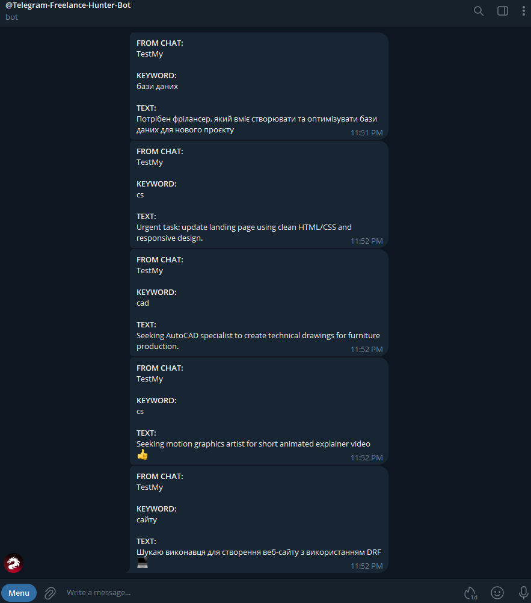
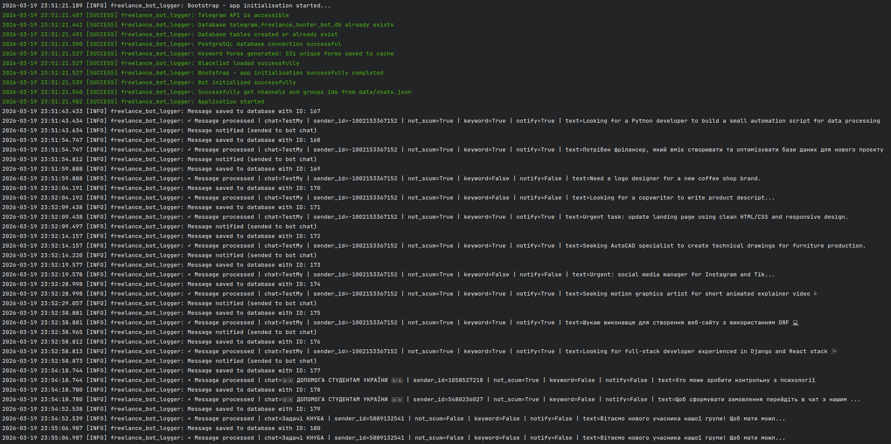

<h1 align="center">Telegram Freelance Hunter Bot</h1>

<p align="center">
  
  
  
  
  
  
  
  
</p>

<p align="center">
  Monitors Telegram chats and channels for freelance/student task requests.<br/>
  Detects keywords, filters blacklisted senders, saves history to PostgreSQL,<br/>
  and instantly forwards matching messages to your personal chat
</p>

---

## Author

Developed and maintained by: **Volodymyr Dotsiak**

<p>
  <a href="mailto:VolodymyrDotsiakOfficial@gmail.com">
    
  </a>
</p>
<p>
  <a href="https://www.linkedin.com/in/volodymyr-dotsiak-0b4a6b201/">
    
  </a>
</p>
<p>
  <a href="https://github.com/xXxDEIMOSxXx">
    
  </a>
</p>

Telegram bots | Automation | Freelance tools | Python | Aiogram | Telethon | PostgreSQL | SQLAlchemy | Pymorphy | Inflect

***Open to collaboration, feedback, job offers, and new ideas!***

---

## Table of Contents

- [Overview](#overview)
- [Commands](#commands)
- [Project structure](#project-structure)
  - [Configuration](#configuration)
  - [Utils](#utils)
  - [Entrypoint](#entrypoint)
  - [Bootstrap](#bootstrap)
  - [Bot](#bot)
  - [Database](#database)
  - [Services](#services)
  - [Telegram Client](#telegram-client)
- [Data Table](#data-table)
- [Output](#output)
- [Test Cases](#test-cases)
- [Preview](#preview)

---

## Overview

The bot runs two parallel services:

- **Telethon userbot** - logs into Telegram as a regular user and listens to configured chats/channels in real time
- **aiogram bot** - receives forwarded notifications and handles user commands (`/start`, `Clear history`)

```text
Telegram Chats
     │
     ▼
 Telethon listener
     │
     ▼
 Message processor ──► Keyword match? ──► No ──► Save to DB only
     │
     ▼
 Blacklist check ────► Blocked? ────────► Yes ──► Save to DB only
     │
     ▼
 Save to DB + Notify aiogram bot ──► BOT_CHAT_ID
```

## Commands

### Main workflow via `Makefile`

| Action | Command |
|:-------|:--------|
| Show all shortcuts | `make help` |
| Install dependencies | `make install` |
| Run the bot locally | `make run-local` |
| Run tests | `make test` |
| Run tests with coverage | `make test-cov` |
| Run lint checks | `make lint` |
| Auto-format code | `make format` |
| Run pre-commit hooks | `make pre-commit` |
| Build Docker images | `make build` |
| Start Docker services | `make up` |
| Show Docker status | `make ps` |
| Follow Docker logs | `make logs` |
| Stop Docker services | `make down` |

### Raw commands (optional reference)

```bash
# local development
poetry install --no-root
poetry run python src/main.py
poetry run pytest
poetry run pytest --cov=src --cov-report=term-missing --cov-report=xml
poetry run ruff check .
poetry run pylint src
poetry run isort src tests
poetry run ruff format .
poetry run pre-commit run --all-files

# docker
docker compose -f docker/docker-compose.yml --env-file .env build
docker compose -f docker/docker-compose.yml --env-file .env up -d --build
docker compose -f docker/docker-compose.yml --env-file .env ps
docker compose -f docker/docker-compose.yml --env-file .env logs -f
docker compose -f docker/docker-compose.yml --env-file .env down
```

---

## Project structure

<a id="configuration"></a>

## Configuration · `src/config.py`

| Property / Field | Type | Description |
|:-----------------|:-----|:------------|
| `API_ID` | `int` | Telegram API ID (Telethon) |
| `API_HASH` | `str` | Telegram API hash (Telethon) |
| `BOT_TOKEN` | `str` | aiogram bot token |
| `BOT_CHAT_ID` | `int` | Target chat for notifications |
| `DB_*` | `str / int` | PostgreSQL connection fields |
| `db_url` | `@property → str` | Builds async SQLAlchemy connection URL |
| `db_config` | `@property → dict` | Returns DB connection dict |
| `channels_and_groups_path` | `@property → Path` | Path to `chats.json` |
| `keywords_path` | `@property → Path` | Path to `keywords.json` |
| `blacklist_path` | `@property → Path` | Path to `blacklist.json` |

---

<a id="utils"></a>

## Utils · `src/utils/`

| File | Function / Class | Signature | Description |
|:-----|:----------------|:----------|:------------|
| `logger.py` | `ColoredFormatter` | `class ColoredFormatter(logging.Formatter)` | Custom formatter - adds color per log level |
| `logger.py` | `ColoredFormatter.format` | `def format(record: LogRecord) -> str` | Wraps log message with ANSI color code |
| `logger.py` | `setup_logger` | `def setup_logger(...) -> logging.Logger` | Creates logger with console + optional file output and custom `SUCCESS` level |

---

<a id="entrypoint"></a>

## Entrypoint · `src/main.py`

| Function | Signature | Description |
|:---------|:----------|:------------|
| `main` | `async def main() -> None` | Runs bootstrap, creates bot and Telethon client, starts polling |

---

<a id="bootstrap"></a>

## Bootstrap · `src/bootstrap.py`

| Function | Signature | Description |
|:---------|:----------|:------------|
| `bootstrap` | `async def bootstrap() -> bool` | Validates API, inits DB, preloads caches - returns `False` on any failure |

---

<a id="bot"></a>

## Bot · `src/bot/`

| File | Function | Signature | Description |
|:-----|:---------|:----------|:------------|
| `bot.py` | `create_bot` | `def create_bot() -> tuple[Bot, Dispatcher]` | Creates aiogram bot + dispatcher with registered routers |
| `handlers/start.py` | `cmd_start` | `async def cmd_start(message: Message) -> None` | Handles `/start` - sends welcome message and reply keyboard |
| `handlers/cleanup.py` | `cmd_cleanup` | `async def cmd_cleanup(message: Message) -> None` | Handles `Clear history` - deletes up to 50 recent messages |

---

<a id="database"></a>

## Database · `src/database/`

| File | Function / Class | Signature | Description |
|:-----|:----------------|:----------|:------------|
| `connection.py` | `ensure_database_exists` | `def ensure_database_exists() -> None` | Creates PostgreSQL DB if it doesn't exist |
| `connection.py` | `create_tables` | `async def create_tables() -> None` | Creates all ORM-defined tables |
| `connection.py` | `init_database` | `async def init_database() -> None` | Full DB init: ensure DB → create tables → test connection |
| `models.py` | `TelegramMessage` | `class TelegramMessage(Base)` | ORM model for `telegram_bot_messages_history` table |
| `repository.py` | `save_message` | `async def save_message(session, message_data) -> int` | Inserts message row, returns `message_id` |

---

<a id="services"></a>

## Services · `src/services/`

| File | Function / Method | Signature | Description |
|:-----|:-----------------|:----------|:------------|
| `blacklist.py` | `BlacklistService._load` | `def _load() -> None` | Loads blacklisted user IDs from JSON into memory cache |
| `blacklist.py` | `BlacklistService.is_blacklisted` | `def is_blacklisted(user_id: int) -> bool` | O(1) lookup - returns `True` if sender is blocked |
| `blacklist.py` | `BlacklistService.preload` | `def preload() -> None` | Force-loads cache at bootstrap |
| `chats.py` | `get_chats_data` | `def get_chats_data() -> list[dict]` | Loads monitored chat list from `chats.json` |
| `keywords.py` | `KeywordService._load_keyword_forms` | `def _load_keyword_forms() -> None` | Loads keywords and generates all morphological forms |
| `keywords.py` | `KeywordService._get_word_forms` | `@staticmethod def _get_word_forms(words_list) -> set[str]` | Expands words into UA/RU/EN morphological variants |
| `keywords.py` | `KeywordService.preload` | `def preload() -> None` | Force-loads keyword cache at bootstrap |
| `keywords.py` | `KeywordService.find_keyword_in_message_text` | `def find_keyword_in_message_text(text: str) -> tuple[bool, str]` | Searches message text for any cached keyword form |
| `message_processor.py` | `process_message` | `async def process_message(event, chat_link, session) -> dict` | Core pipeline: extract → keyword check → blacklist check → save → notify |
| `network.py` | `check_telegram_api_connection` | `async def check_telegram_api_connection() -> None` | HTTP check to Telegram `getMe` endpoint - logs result |

---

<a id="telegram-client"></a>

## Telegram Client · `src/telegram_client/`

| File | Function | Signature | Description |
|:-----|:---------|:----------|:------------|
| `client.py` | `create_telegram_client` | `def create_telegram_client(bot: Any) -> TelegramClient` | Builds Telethon client with retry config and registers message handler |
| `handlers/new_message.py` | `register_message_handler` | `def register_message_handler(client, bot) -> None` | Registers `NewMessage` event listener across all configured chat IDs |

---

## Data Table

PostgreSQL table: `telegram_bot_messages_history`

| Column              | Type                        | Description                              |
|:--------------------|:---------------------------:|:-----------------------------------------|
| `message_id`        | `BigInteger` (PK)           | Auto-incremented primary key             |
| `message_datetime`  | `DateTime (timezone=True)`  | UTC timestamp of message receipt         |
| `chat_title`        | `Text`                      | Title of the source chat or channel      |
| `chat_id`           | `BigInteger`                | Telegram chat ID                         |
| `sender_id`         | `BigInteger`                | Telegram user ID of message sender       |
| `have_keyword`      | `Boolean`                   | `True` if a keyword was matched          |
| `keyword`           | `Text`                      | Matched keyword form, or `"-"`           |
| `not_scum`          | `Boolean`                   | `True` if sender is NOT blacklisted      |
| `notify`            | `Boolean`                   | `True` if bot notification was sent      |
| `message_text`      | `Text`                      | Full raw message content                 |

---

Console log (initialization):

```
2026-03-19 22:35:34.081 [INFO] freelance_bot_logger: Bootstrap - app initialisation started...
2026-03-19 22:35:34.332 [SUCCESS] freelance_bot_logger: Telegram API is accessible
2026-03-19 22:35:34.371 [SUCCESS] freelance_bot_logger: Database telegram_freelance_hunter_bot_db already exists
2026-03-19 22:35:34.423 [SUCCESS] freelance_bot_logger: Database tables created or already exist
2026-03-19 22:35:34.433 [SUCCESS] freelance_bot_logger: PostgreSQL database connection successful
2026-03-19 22:35:34.461 [SUCCESS] freelance_bot_logger: Keyword forms generated: 531 unique forms saved to cache
2026-03-19 22:35:34.461 [SUCCESS] freelance_bot_logger: Blacklist loaded successfully
2026-03-19 22:35:34.462 [SUCCESS] freelance_bot_logger: Bootstrap - app initialisation successfully completed
2026-03-19 22:35:34.474 [SUCCESS] freelance_bot_logger: Bot initialized successfully
2026-03-19 22:35:34.475 [SUCCESS] freelance_bot_logger: Successfully get channels and groups ids from data/chats.json
2026-03-19 22:35:35.028 [SUCCESS] freelance_bot_logger: Application started
```

---

## Output

When a matching message is found, the bot sends the following to `BOT_CHAT_ID`:

```
FROM CHAT:
TestMy

KEYWORD:
python

TEXT:
I need help creating a python django website
```

---

Console log example (message):

```
2026-03-19 22:36:32.252 [INFO] freelance_bot_logger: Message saved to database with ID: 158
2026-03-19 22:36:32.253 [INFO] freelance_bot_logger: ✓ Message processed | chat=TestMy | sender_id=-1002153367152 | not_scum=True | keyword=True | notify=True | text=I need help creating a python django website
2026-03-19 22:36:32.500 [INFO] freelance_bot_logger: Message notified (sended to bot chat)
```

---

## Test Cases

Test suite: `tests/`

| Test File                      | What It Covers                                      |
|:-------------------------------|:----------------------------------------------------|
| `test_main.py`                 | Application entry point and startup logic           |
| `test_bootstrap.py`            | Bootstrap success and failure flows                 |
| `test_network.py`              | Telegram API connectivity checks                    |
| `test_database_connection.py`  | Engine init, table creation, session factory        |
| `test_bot_creation.py`         | aiogram bot + dispatcher initialization             |
| `test_telegram_client.py`      | Telethon client creation and handler registration   |
| `test_keywords.py`             | Keyword loading, form generation, search            |
| `test_blacklist.py`            | Blacklist loading, caching, and lookup              |
| `test_chats.py`                | Chat config loading and error handling              |
| `test_models.py`               | SQLAlchemy ORM model structure                      |
| `test_repository.py`           | Database message save and rollback                  |
| `test_message_processor.py`    | Full message processing pipeline                    |
| `test_message_handler.py`      | New message event handler behavior                  |
| `test_handlers.py`             | `/start` and `Clear history` command handlers       |


**Results (current):**

```
86 passed
Coverage: 94% (src/)
Lint: ruff check src tests → All checks passed
```

Run tests:

```bash
make test
make test-cov
```

Raw equivalent:

```bash
poetry run pytest
poetry run pytest --cov=src --cov-report=term-missing --cov-report=xml
```

---

## Preview

<div align="center">
  
  <br>
  <em>Bot finding freelance gigs in real-time (bot-chat)</em>
</div>

<br>
<br>

<div align="center">
  
  <br>
  <em>Bot finding freelance gigs in real-time (console-log)</em>
</div>

[Back to top](#table-of-contents)
